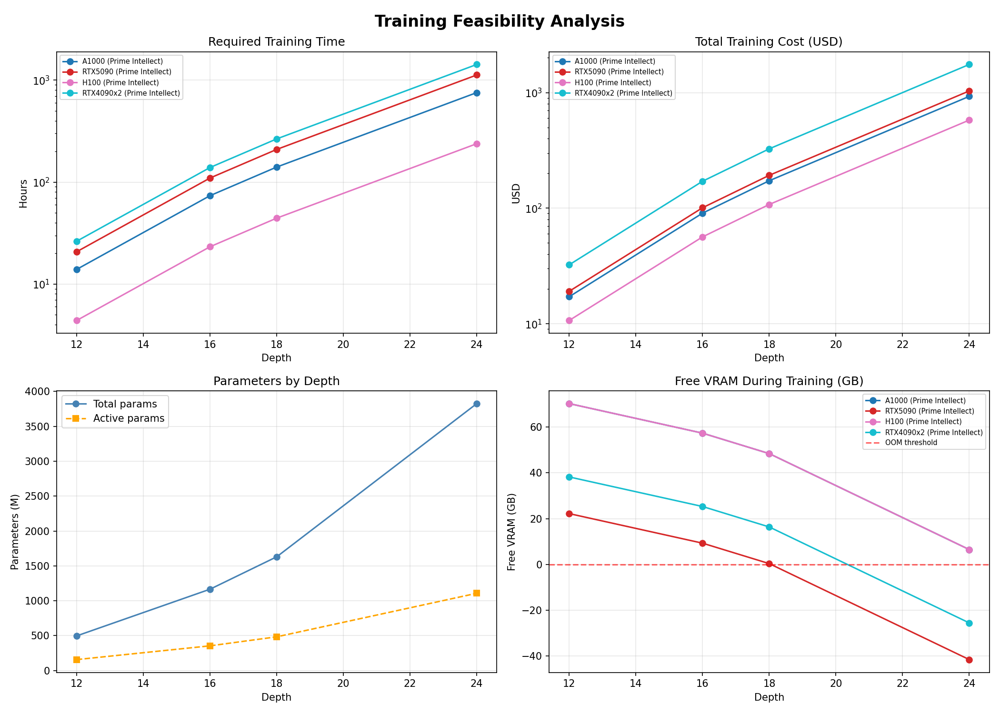
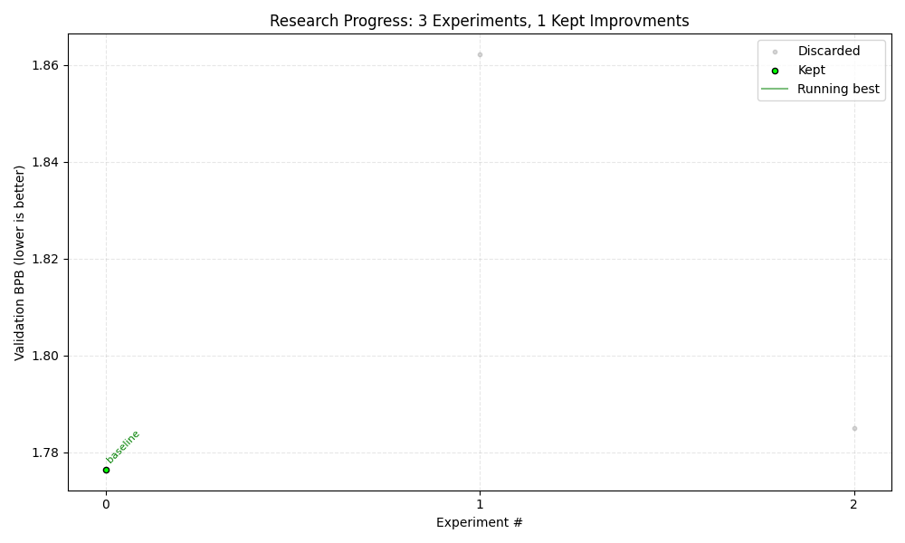

# pipeline

LLM training pipeline built for learning ML and experimenting with architectures and hyperparameters. Started after I quit my English Lit degree to focus on self-learning ML/AI full time. The goal is to train somewhat unique LLMs from scratch, with the compute budget limited to what I can personally afford, which isn't much, but I try.

## model

The old version of this repository (when it was using a GPT-2 style architecture) has been used to train [rudyon/rudygpt](https://huggingface.co/rudyon/rudygpt) which was then instruct fine-tuned into [rudyon/rudygpt-instruct](https://huggingface.co/rudyon/rudygpt-instruct). You can talk to said model in a HuggingFace [space](https://huggingface.co/spaces/rudyon/rudygpt) I made. Information about future training runs will be added here as new models are released.

## architecture

The model uses a single `depth` parameter to scale everything, this was inspired by [nanochat](https://github.com/karpathy/nanochat).

I am trying to improve the architecture over time with experiments. At the time of writing the architecture is as follows:

| Component | Implementation |
|-----------|---------------|
| Positional encoding | RoPE (base=50000) |
| Attention | GQA + QK Norm + FlashAttention |
| FFN | SwiGLU (8/3 × n_embd hidden dim) |
| Normalization | RMSNorm |
| Sequence mixing | Causal depthwise Conv1d (kernel=3) |
| Sparsity | MoE (8 experts, top-2) |
| Optimizer | Muon + AdamW |

## experiments

I am running experiments on this repository to try and improve the architecture/hyperparameters. The experiments are done by making a change to the codebase and then running `experiment.sh` on Kaggle with 2xT4s which does a training run with a time budget of 5 minutes and `depth=4` on 2 shards of the [HuggingFaceFW/fineweb-edu](https://huggingface.co/datasets/HuggingFaceFW/fineweb-edu) dataset. When the experiment is done it is logged into `experiments.jsonl` and `plot.py` is run to regenerate the graph below. The results of the experiments are kept in the repo going forward if validation BPB dropped compared to the previous best validation BPB.

